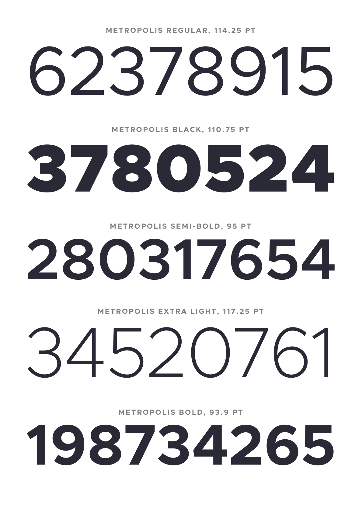

> Originally from https://github.com/chrismsimpson/Metropolis

# Metropolis

A modern, geometric typeface. Influenced by other popular geometric, minimalist sans-serif typefaces of the new millenium. Designed for optimal readability at small point sizes while beautiful at large point sizes.

